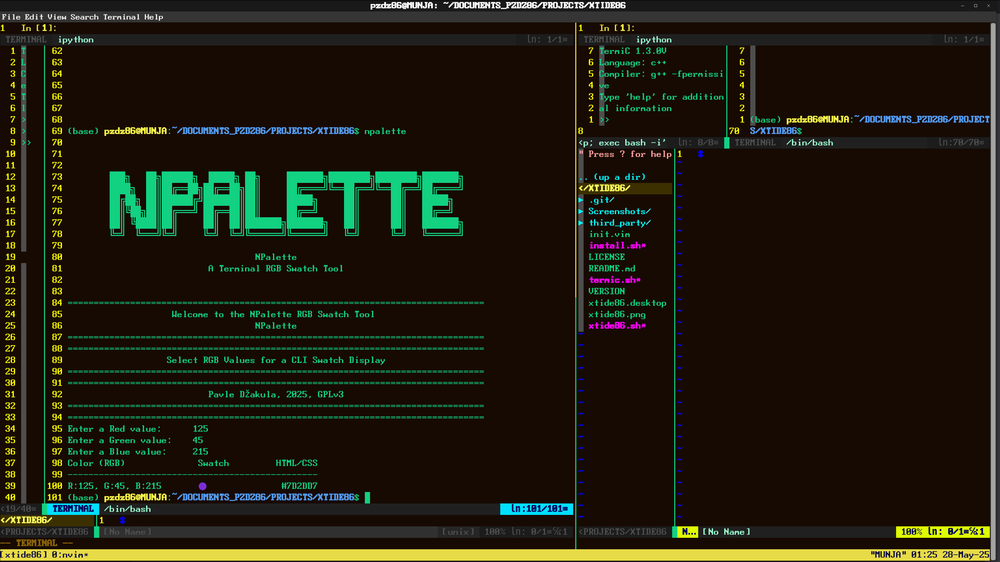
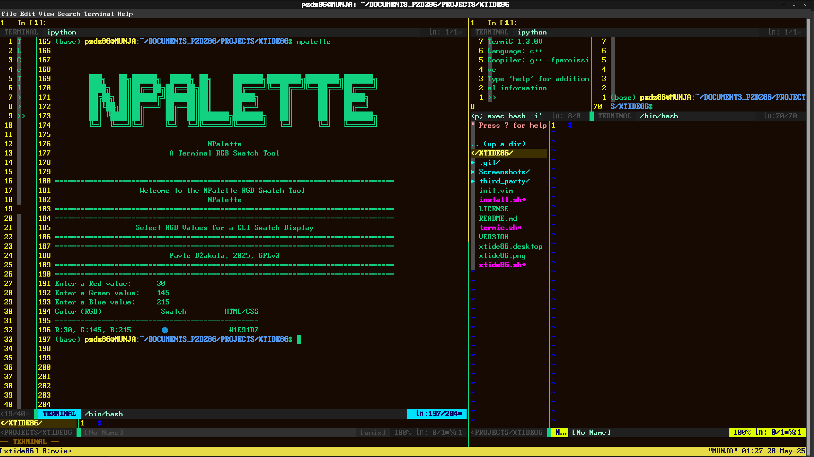

## License

NPalette is licensed under the GNU General Public License v3.0 or later.  
See the [LICENSE](./LICENSE) file for full details.

# NPalette

**A color swatch visualization tool for you terminal**  
A color swatch visualization tool for your terminal

Part of the [Tide42](https://github.com/logicmagix/Tide42) ecosystem — a modular terminal IDE for command-line enthusiasts.

## About NPalette

NPalette is a lightweight command-line utility that prompts RGB values and renders a live ANSI color swatch in the terminal, alongside its HTML/CSS hexadecimal representation.

This tool is ideal for:

Terminal theme designers

Web developers choosing color palettes

Quick visual RGB-to-HEX checks without leaving the CLI

## Features

Convert integers into:
  - Prompt-based input for red, green, and blue components
  - ANSI-rendered color swatch
  - Outputs RGB and HEX values in a clean, tabular format
  - Uses logicmagix shared prompt handler for consistent UX
  - Works as a standalone CLI script *or* editable live in IPython/Tide42

## Installation
Simple clone the repo or extract the zip and run ./installer.sh to use NPalette standalone or within [`Tide42`](https://github.com/logicmagix/Tide42)
        

## Screenshots

### NPalette Output1

### NPalette Output2

## Usage
Simply run npalette after installation

